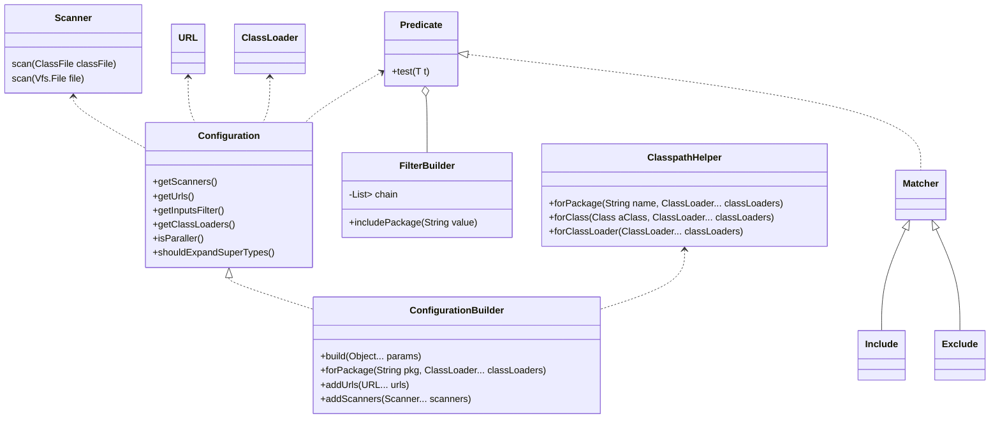
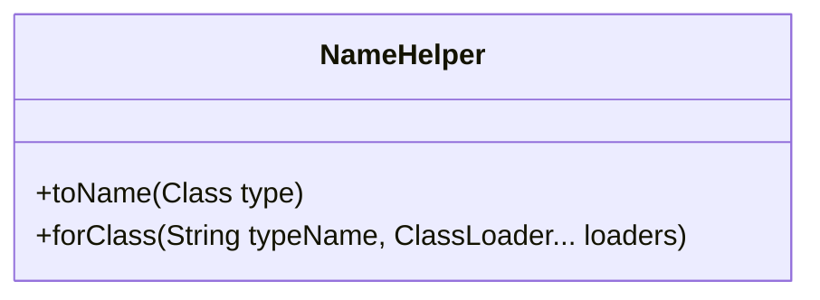
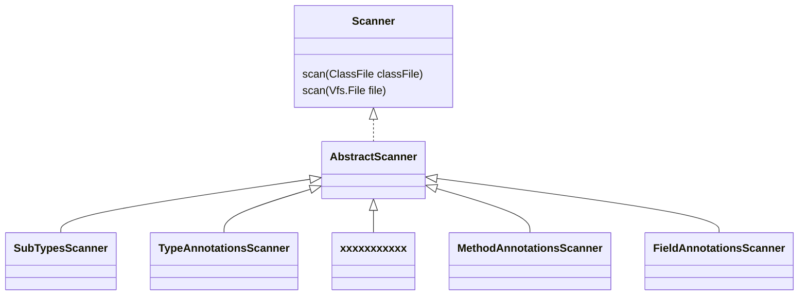
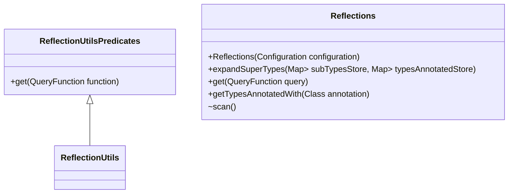
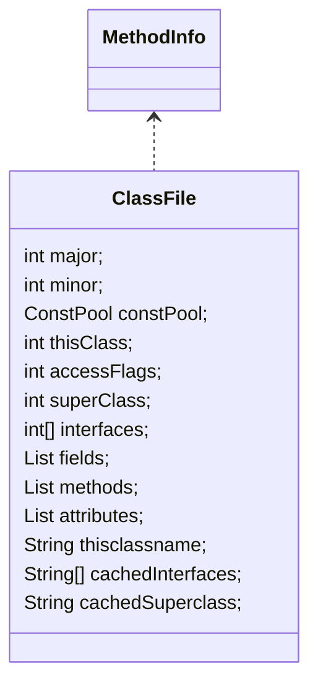

- Annotated
  - FieldsAnnotated
  - MethodAnnotated
  - MethodAnnotated
  - ConstructorsAnnotated
  - TypesAnnotated
- Signature
  - ConstructorsSignature
  - MethodsSignature
- Parameter
  - ConstructorsParameter
  - MethodsParameter
- Scanner
  - MenberUsageScanner
  - MethodParameterNamesScanner
- Subtypes
- MethodsReturn
- Resources